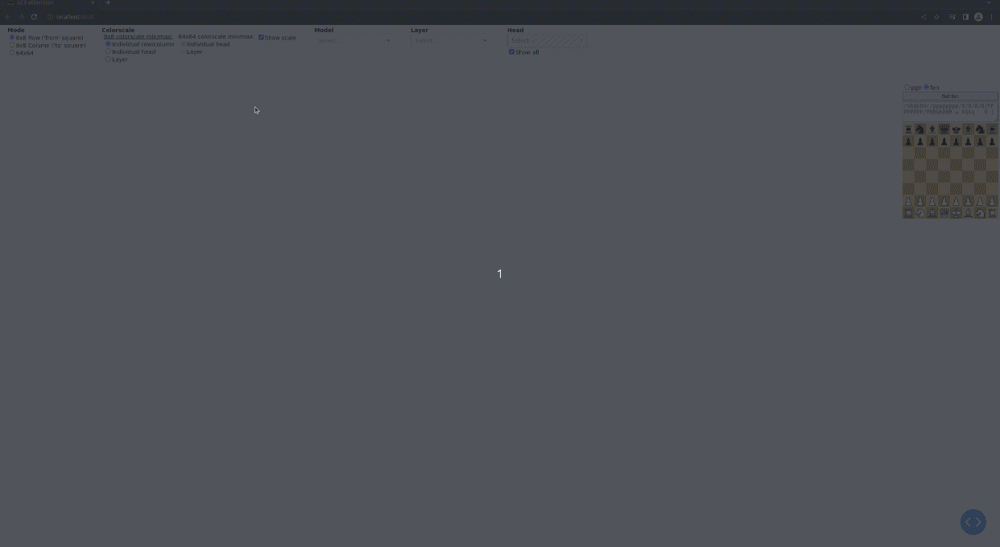

# lc0-attention-visualizer (WIP)
Visualizes attention layer activations of lc0 attention body nets as heatmaps.

## Demo


## Quick start using conda env
1. Clone this repo:
 ```
    git clone https://github.com/Ergodice/lc0-attention-visualizer.git lc0-attention-visualizer
    cd lc0-attention-visualizer
```
2. Create conda environment and install dependencies for lczero-training and attention visualizer:
```
conda create -n attention-visualizer python=3.8
conda activate attention-visualizer
conda install -c anaconda cudatoolkit

pip install tensorflow==2.10
pip install protobuf
pip install tensorflow-addons
pip install pyyaml
pip install python-chess
pip install dash
```

3. Clone and setup attention-net-body branch of lczero-training:
```
git clone -b master  https://github.com/ergodice/lczero-training.git lczero-training
cd lczero-training
sh init.sh
cd ..
```

4. Prepare model folder where visualizer can read attention models from:
   * Create folder called `models`
   * place at least one model folder inside models folder that containts at least one attention body net and config.yaml 
   for that net architecture
   * In the end folder structure could look like:
   ```
   lc0-attention-visualizer/
        models/
            architecture1/
                cfg.yaml
                BT1024-3142c-swa-186000.pb.gz
                BT1024-rl-lowlr-swa-236500.pb.gz
            architecture2/
                cfg.yaml
                modelxxx.pb.gz
        run.py
        ...
    ```
    * Add `return_attn_wts: true` under `model` in the configuration file
 

5. Run the gui
```
python run.py
```

GUI should soon launch in your default browser.